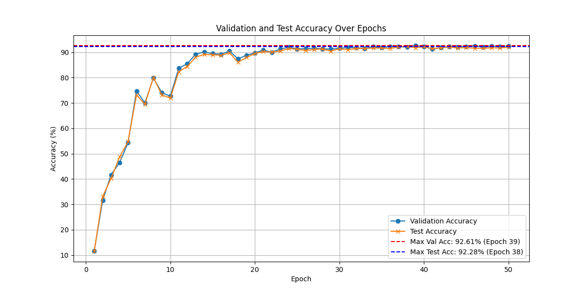
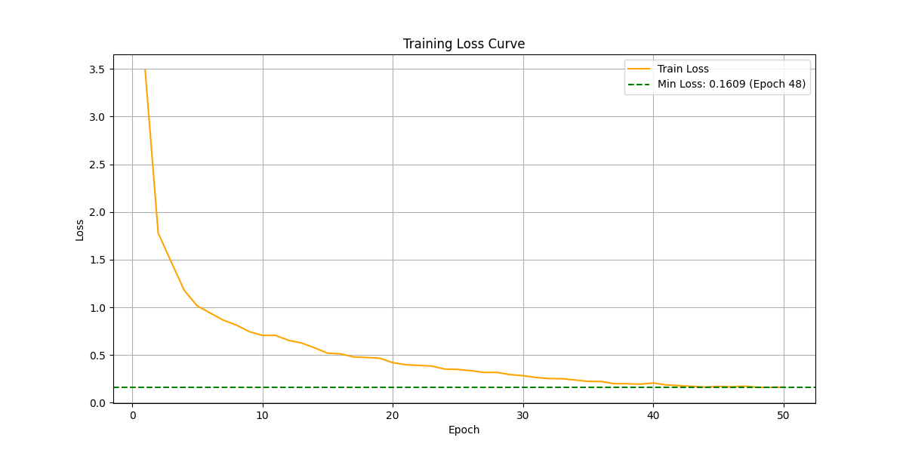

# Gesture_Recognition
通过mediapipe对高通Jester数据集做简单的关键点检测与可视化，将RGB视频流数据转化为手部骨架数据

基于ST-GCN实现手势识别：在原模型的基础上进行了修改，使网络适配手部的关键点结构。
未来会实现笔记本前置摄像头实现手势识别的系统。

## 基础条件
数据集：高通Jester

姿态估计算法：谷歌Mediapipe


原始模型：ST-GCN（https://github.com/yysijie/st-gcn）

## 关键点可视化
随机选取一个样本进行可视化

https://github.com/user-attachments/assets/413836fa-fb95-42bc-82d0-309ec7951ed0

https://github.com/user-attachments/assets/c51e2d90-3229-48d3-a341-60668f7f3518

## 训练曲线





## 实时系统


## 文件结构 (File Structure)

```bash
.
├── log/                           # 训练日志
├── st-gcn/                        # 模型定义(修改ST-GCN使其适配手部拓扑结构，未上传公开)
├── npy_visualizations/            # npy_checkd的结果展示
├── 标注/                          # 开源社区找到的Jester标注(Test未公开)
├── classfy_dataset.py             # 基于标注划分数据集
├── process_dataset.py             # 数据预处理
├── keypoint_extraction_v5.py      # 对视频数据进行关键点检测，保存结果并在原视频上可视化
├── npy_check/                     # keypoint_extraction_v5.py的关键点进行2D与3D可视化 
├── try_v5.py                      # 训练代码
├── v_log_v2.py                    # 日志可视化
└── qianduan.py                    # 搭建简单的前端窗口，针对单个数据样本实现模型的调用推理
